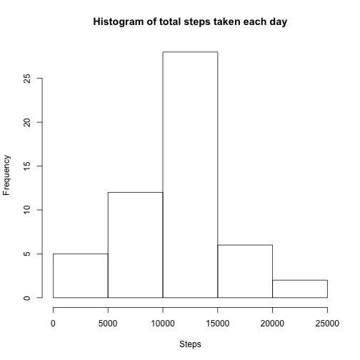
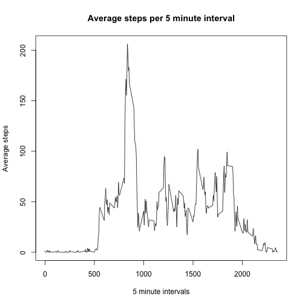
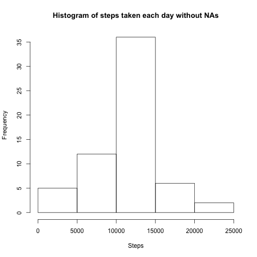
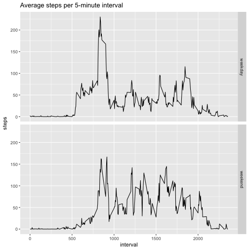

##Literate Statistical Programming - R Markdown

=============================================================


###Loading required packages


###Loading and preprocessing the data

```r
data <- read.csv("Activity.csv")
data$date <- as.POSIXct(data$date)
head(data)
```

```
##   steps       date interval
## 1    NA 2012-10-01        0
## 2    NA 2012-10-01        5
## 3    NA 2012-10-01       10
## 4    NA 2012-10-01       15
## 5    NA 2012-10-01       20
## 6    NA 2012-10-01       25
```

###What is mean total number of steps taken per day?
For this part of the assignment, you can ignore the missing values in the dataset.

1. Calculate the total number of steps taken per day
2. If you do not understand the difference between a histogram and a barplot, research the difference between them. Make a histogram of the total number of steps taken each day
3. Calculate and report the mean and median of the total number of steps taken per day


```r
datastepsperday <- aggregate(steps ~ date, data=data, sum, na.rm=T)

hist(datastepsperday$steps, main="Histogram of total steps taken each day", xlab="Steps")
```



```r
summarystepsperday <- summary(datastepsperday$steps)
summarystepsperday
```

```
##    Min. 1st Qu.  Median    Mean 3rd Qu.    Max. 
##      41    8841   10760   10770   13290   21190
```

```r
Mean1 <- as.character(summarystepsperday[["Mean"]])
Median1 <- as.character(summarystepsperday[["Median"]])
```

**Mean steps per day : 10770**  
**Median of steps per day : 10760**


###What is the average daily activity pattern?
1. Make a time series plot (i.e. 𝚝𝚢𝚙𝚎 = "𝚕") of the 5-minute interval (x-axis) and the average number of steps taken, averaged across all days (y-axis)


```r
averagestepsperinterval <- aggregate(steps ~ interval, data=data, mean, na.rm=T)

head(averagestepsperinterval,15)
```

```
##    interval     steps
## 1         0 1.7169811
## 2         5 0.3396226
## 3        10 0.1320755
## 4        15 0.1509434
## 5        20 0.0754717
## 6        25 2.0943396
## 7        30 0.5283019
## 8        35 0.8679245
## 9        40 0.0000000
## 10       45 1.4716981
## 11       50 0.3018868
## 12       55 0.1320755
## 13      100 0.3207547
## 14      105 0.6792453
## 15      110 0.1509434
```

```r
plot(averagestepsperinterval$interval, averagestepsperinterval$steps, type="l",
     main="Average steps per 5 minute interval",
     xlab="5 minute intervals",
     ylab="Average steps")
```




2. Which 5-minute interval, on average across all the days in the dataset, contains the maximum number of steps?

```r
averagestepsperinterval[averagestepsperinterval$steps == max(averagestepsperinterval$steps), "interval"]
```

```
## [1] 835
```


###Imputing missing values
Note that there are a number of days/intervals where there are missing values (coded as 𝙽𝙰). The presence of missing days may introduce bias into some calculations or summaries of the data.

1. Calculate and report the total number of missing values in the dataset (i.e. the total number of rows with 𝙽𝙰s)


```r
NArows <- is.na(data$steps)
TotalrowswithNA <- sum(NArows)
```

**There are a total of 2304 rows with NAs.**


2. Devise a strategy for filling in all of the missing values in the dataset. The strategy does not need to be sophisticated. For example, you could use the mean/median for that day, or the mean for that 5-minute interval, etc.

**Below code replaces NA values with mean steps for the 5-minute interval**


```r
dataWithNA <- subset(data, is.na(steps))
dataWithoutNA <- subset(data, !is.na(steps))

for(i in 1:nrow(dataWithNA)){
        meansteps <- subset(averagestepsperinterval, interval==dataWithNA$interval[i])$steps
        
        dataWithNA$steps[i] <- meansteps
}

imputeddata <- rbind(dataWithNA, dataWithoutNA)
```


3. Create a new dataset that is equal to the original dataset but with the missing data filled in.  
*Dataset created in above set*

```r
head(imputeddata,15)
```

```
##        steps       date interval
## 1  1.7169811 2012-10-01        0
## 2  0.3396226 2012-10-01        5
## 3  0.1320755 2012-10-01       10
## 4  0.1509434 2012-10-01       15
## 5  0.0754717 2012-10-01       20
## 6  2.0943396 2012-10-01       25
## 7  0.5283019 2012-10-01       30
## 8  0.8679245 2012-10-01       35
## 9  0.0000000 2012-10-01       40
## 10 1.4716981 2012-10-01       45
## 11 0.3018868 2012-10-01       50
## 12 0.1320755 2012-10-01       55
## 13 0.3207547 2012-10-01      100
## 14 0.6792453 2012-10-01      105
## 15 0.1509434 2012-10-01      110
```
  
  

4. Make a histogram of the total number of steps taken each day and Calculate and report the mean and median total number of steps taken per day. Do these values differ from the estimates from the first part of the assignment? What is the impact of imputing missing data on the estimates of the total daily number of steps?

```r
imputedDataStepsPerDay <- aggregate(steps ~ date, data=imputeddata, sum, na.rm=TRUE)

hist(imputedDataStepsPerDay$steps, 
     main = "Histogram of steps taken each day without NAs",
     xlab="Steps"
     )
```



```r
imputedsummary <- summary(imputedDataStepsPerDay$steps)
imputedsummary
```

```
##    Min. 1st Qu.  Median    Mean 3rd Qu.    Max. 
##      41    9819   10770   10770   12810   21190
```

```r
Mean2 <- as.character(imputedsummary[["Mean"]])
Median2 <- as.character(imputedsummary[["Median"]])
```

**After imputing the missing values in the dataset, the mean steps per day is 10770 and median steps per day is 10770.**  
  
**Before Imputing, Mean = 10770 and Median = 10760.**  
**After Imputing, Mean = 10770 and Median = 10770.**  
  
  
###Are there differences in activity patterns between weekdays and weekends?
For this part the 𝚠𝚎𝚎𝚔𝚍𝚊𝚢𝚜() function may be of some help here. Use the dataset with the filled-in missing values for this part.

1. Create a new factor variable in the dataset with two levels – “weekday” and “weekend” indicating whether a given date is a weekday or weekend day.
2. Make a panel plot containing a time series plot (i.e. 𝚝𝚢𝚙𝚎 = "𝚕") of the 5-minute interval (x-axis) and the average number of steps taken, averaged across all weekday days or weekend days (y-axis). See the README file in the GitHub repository to see an example of what this plot should look like using simulated data.


```r
imputeddata$day <- character(nrow(imputeddata))

for(i in 1:nrow(imputeddata)){
        wday <- weekdays(imputeddata$date[i], abbreviate=T)
        
        possibleweekdays <- c("Mon","Tue","Wed","Thu","Fri")
        
        if(wday %in% possibleweekdays){
                imputeddata$day[i] <- "weekday"
        }
        else{
                imputeddata$day[i] <- "weekend"
        }
}

imputeddata$day <- as.factor(imputeddata$day)

imputeddata_by_day_interval <- aggregate(steps ~ interval + day, data=imputeddata, mean)

head(imputeddata_by_day_interval)
```

```
##   interval     day      steps
## 1        0 weekday 2.25115304
## 2        5 weekday 0.44528302
## 3       10 weekday 0.17316562
## 4       15 weekday 0.19790356
## 5       20 weekday 0.09895178
## 6       25 weekday 1.59035639
```

```r
g <- ggplot(imputeddata_by_day_interval, aes(interval,steps))
g + geom_line() + facet_grid(day~.) + ggtitle("Average steps per 5-minute interval")
```




